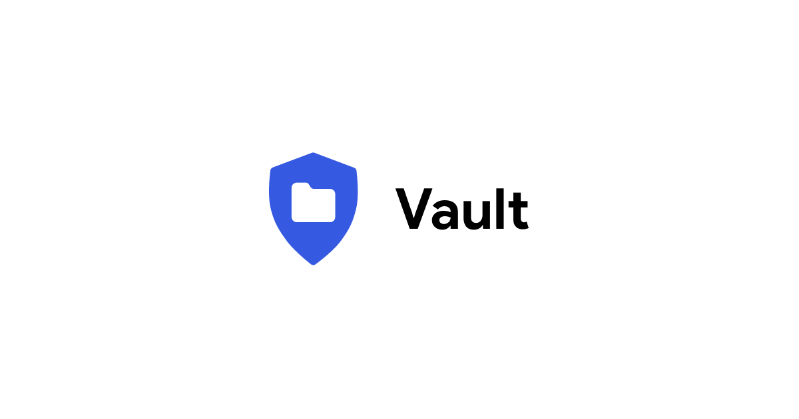

# Vault

Vault es una aplicación construida en Jetpack Compose que te ayuda a compartir archivos de manera segura entre 2 entidades usando algoritmos criptográficos

### Algoritmos criptográficos
- Cifrado por bloques AES 256 en modo GCM para el cifrado de archivos, se elige este algoritmo porque el modo GCM impide modificar la información por medio de ataques de cambios de bits, lo cual brinda confidencialidad e integridad.
- HMAC con SHA-256 para garantizar la integridad de la información, se elige este algoritmo porque es menos afectado por los ataques de colisión y no tiene las mismas debilidades que solo usar SHA-256.
- ECDSA con la curva recomendada por la organización NIST, NIST P-384 para el firmado y verificación de los archivos, se elige este algoritmo debido a que es menos afectado por los ataques de factorización.
- ECDH para el intercambio seguro de claves utilizando curvas elípticas, se elige este algoritmo ya que incluso si una clave privada se ve comprometida en el futuro, las claves anteriores y futuras permanecen seguras.
